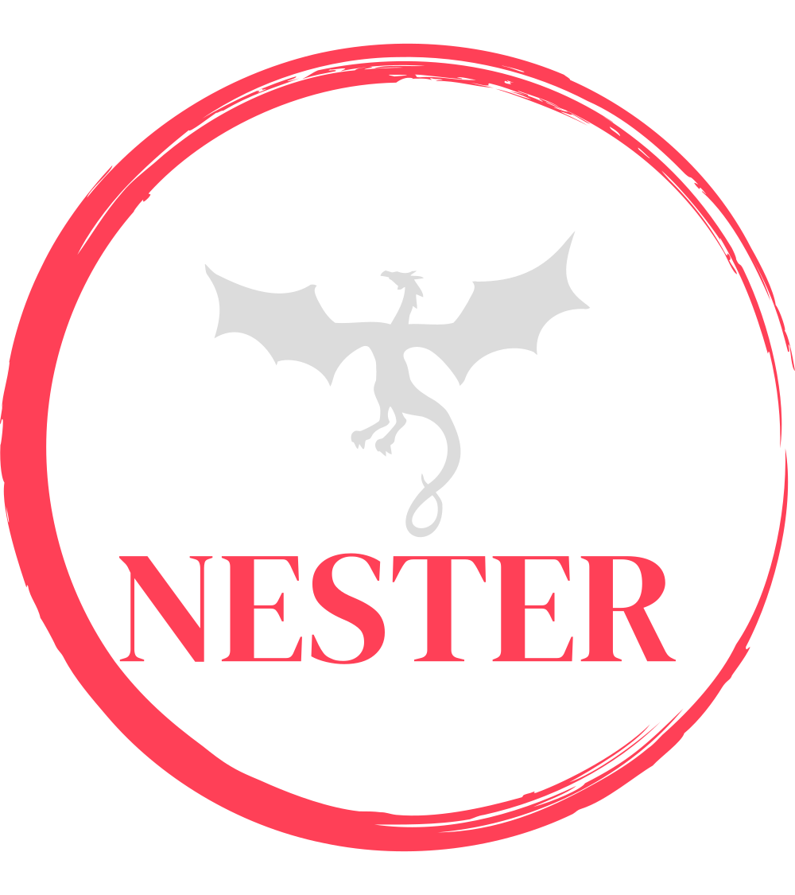

<h2 align="center" style="text-decoration:underline">Contributing to Nester</h2>

Thank you for your interest in contributing to Nester! Nester is a tool for setting up programming project structures using JSON schemas stored in `src/nester/templates`. To make the contribution process smooth and efficient, please read the following guide.

**Table of Contents**
- [Clone the Repository](#clone-the-repository)
- [Install Requirements](#install-requirements)
- [Use Pull Request and Issue Templates](#use-pull-request-and-issue-templates)
- [Feature Requests](#feature-requests)
- [Keeping Style](#keeping-style)
- [Documentation](#documentation)
- [Submitting a Pull Request](#submitting-a-pull-request)


## Clone the Repository

To start contributing to Nester, you will first need to clone the GitHub repository. You can do this by following these steps:

1. Go to the Nester GitHub repository: https://github.com/ByteOtter/nester
2. Click on the "Fork" button in the top right corner to create a fork of the repository on your GitHub account.
3. Clone your forked repository to your local machine using `git clone` command. Replace `yourusername` with your actual GitHub username:

```shell
git clone git@github.com:yourusername/nester.git
```

Now you have a local copy of the Nester repository on your machine.

## Install Requirements

Nester uses `setuptools` as its build tool and `pyproject.toml` and `setup.cfg` as configuration files. **We strongly recommend you use a `virtualenv` to isolate your development environment from the rest of your system.** To install the requirements for Nester, you can use `pip` as follows:

1. Change to the Nester directory:

```shell
cd nester
```

2. Install the dependencies listed in `setup.cfg` using `pip`:

```shell
pip install -e .
```

This should install all necessary requirements for nester aswell as nester itself.<br>
Using the `-e` flag will also install Nester as `editable`. Which means that your installation of Nester within your virtual environment will update itself when you make changes to the code.<br>
*Note*: Sometimes it is still required to uninstall your Nester installation and reinstall it. Run `pip uninstall nester-struct` to uninstall it.

>Note: If you encounter any issues with dependencies or installation, please refer to the troubleshooting section or reach out for help in the issues section or via email.

## Use Pull Request and Issue Templates

As a project owner, I encourage you to use the provided Pull Request and Issue templates when contributing to Nester. These templates provide guidelines and instructions for creating effective Pull Requests (PRs) and Issues. Please follow the template and provide as much information as possible to help us understand your contribution or question.

When creating a PR, make sure to include a detailed description of the changes you made, including any relevant code changes, tests, and documentation updates. If your contribution requires a new feature or a bug fix, please explain the rationale behind it and provide any necessary context.

For issues, please provide a clear and concise description of the problem, along with any relevant steps to reproduce it, error messages, and expected behavior.

By using the provided templates, you can help ensure that your contributions are reviewed and addressed in a timely manner, and that your questions are answered effectively.

Thank you for your contribution to Nester! We appreciate your effort and look forward to reviewing your contributions. If you have any questions, feel free to ask in the issues section or via email.

## Feature Requests

Like most other projects out there we strife to expand Nester's functionality and language support. However, there are some guidelines we would like you to respect, when it comes to suggesting new languages specifically.

- The suggested language must have at least a widely accepted standard of how a project needs to be structured. This structure must make sense and must be able to be read by the language's compiler or build systems

- Documentation needs to be provided as context when suggesting a new language structure or the change of an existing one. A good example would be official style guides found in the language's documentation

- Languages with existing set up commands. We are aware that there are languages (Like Go, Ruby or Rust) which come with some form of CLI setup utility. And despite us being interesting in linking them into Nester aswell (by calling their utility), for now we would like you to refrain from suggesting these as they do not have priority for us.

## Keeping Style

To maintain consistent code style in Nester, we use the [Black](https://black.readthedocs.io/en/stable/) code formatter. Before submitting your changes, please run the Black formatter on your code to ensure it adheres to the project's style guidelines.

After installing the dependencies and setting up the development environment with `pip install -e .`, you should have Black already installed. You can now run the following command from the root directory of the Nester repository:

```shell
black .
```


Additionally, you can make your life simpler by having `pre-commit` installed.

This tool uses the `.pre-commit-config.yaml` to run checks on your code before you commit your changes with `git`.

>Note: If the black runner of `pre-commit` changes a file you need to `git add` it again. It is a little quirky sometimes.

## Documentation

We highly value good documentation to help users understand and use Nester effectively. When contributing to Nester, please make sure to follow these documentation guidelines:

1. Every commit must have a changelog file containing a sensible changelog message. These files will be built by [Towncrier](https://towncrier.readthedocs.io/en/latest/) into changelogs and must be placed in the `Changelog.d` directory in the project root.

2. When contributing new features, please update the existing documentation or add new documentation as necessary. Nester's documentation is built using [Sphinx](https://www.sphinx-doc.org/en/master/) and published on [Read the Docs](https://readthedocs.org/).

> Note: If you need help with writing documentation, please reach out to us for assistance. Your contributions to documentation are highly appreciated!
## Submitting a Pull Request

When you are ready to submit your contribution, please follow these steps:

1. Create a new branch for your changes. Use a descriptive branch name that summarizes the purpose of your changes.

2. Make your changes and commit them with a clear commit message.

3. Push your branch to your forked repository on GitHub.

4. Open a pull request against the `main` branch of the Nester repository. Please provide a clear title and description for your pull request, and reference any relevant issues or discussions.

5. Your pull request will be reviewed by the project maintainers, and feedback will be provided. Please be responsive to any comments or requests for changes.

6. Once your pull request is approved and all checks pass, it will be merged into the `main` branch.

7. Thank you for your contribution to Nester! Your efforts are greatly appreciated.

> Note: We advise you to pull the latest changes from the upstream repository and rebase your branch before submitting your Pull Request to avoid Merge Conflicts.

Happy hacking!

\- Your Nester Team!

<p align="center">

</img>
</p>
